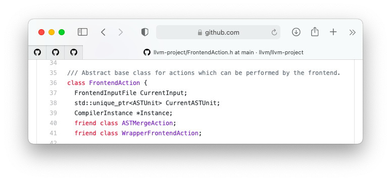
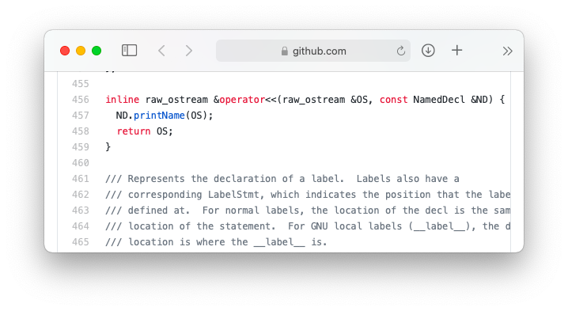
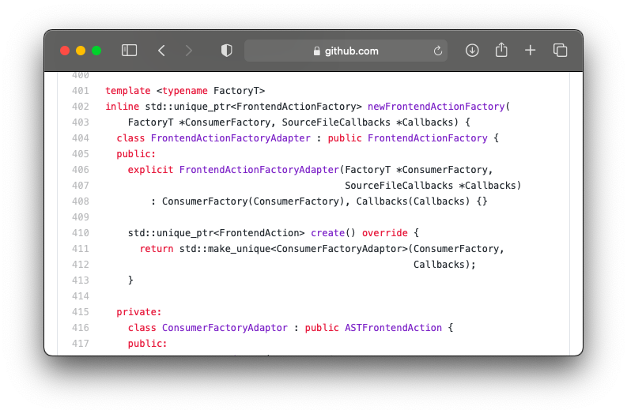
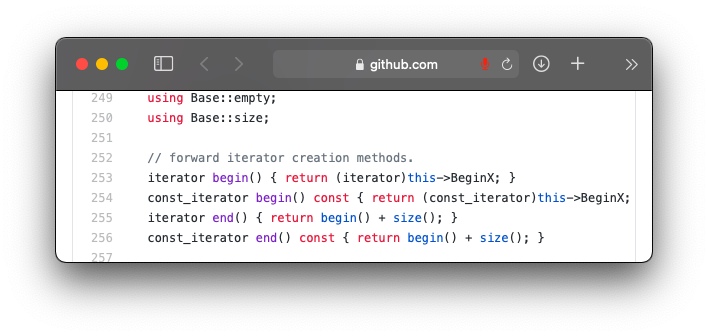
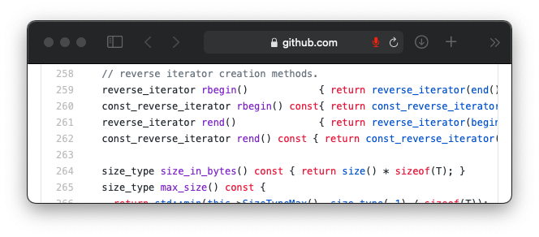
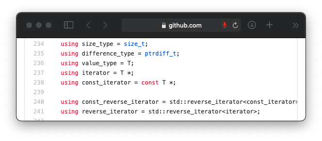
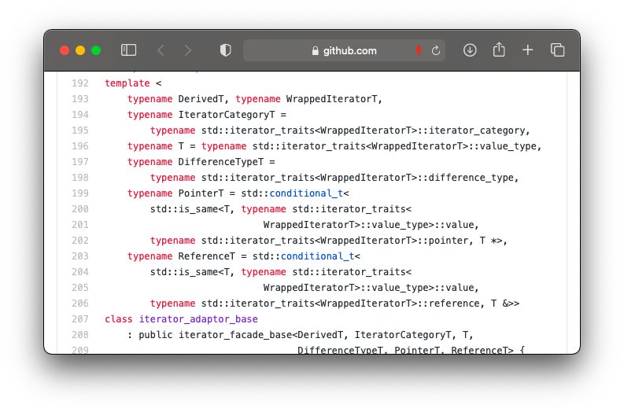
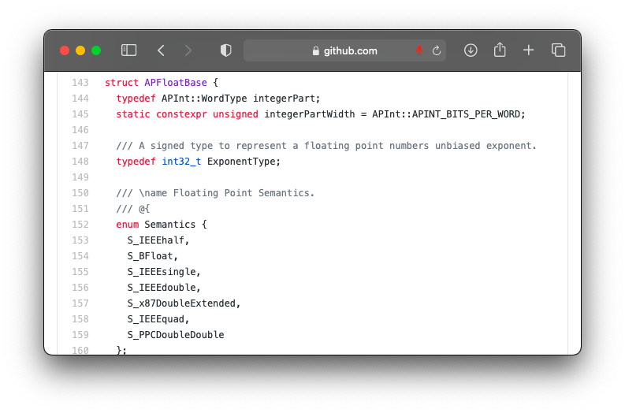

# Report
## I. C++11 / C++14 Features Used
### 1. Friend Class:
A friend class can access private and protected members of other classes in which it is declared as a friend.

Ref1: [FrontendAction.h](https://github.com/llvm/llvm-project/blob/main/clang/include/clang/Frontend/FrontendAction.h)

Here, the classes - ASTMergeAction and WrappedFrontendAction would have access to the private and protected members of FrontendAction class.

Ref2: [Decl.h](https://github.com/llvm/llvm-project/blob/main/clang/include/clang/AST/Decl.h)

Here, the classes - ASTDeclReader and ASTDeclWrited would have access to the private and protected members of the class PragmaCommentDecl.

Ref 3: [ASTConsumer.h](https://github.com/llvm/llvm-project/blob/main/clang/include/clang/AST/ASTConsumer.h)

Here, the class - SemaConsumer will have access to the private and protected members of the ASTConsumer class.

---------------------------------------------------------------------------------------------------------------------------------------------------

### 2. Abstract Class:
When we don’t know about the implementation of any function in the base class, we provide that in the derived class rather than the base class. Such a base class is called an abstract base class.

Ref1: [FrontEndAction.h](https://github.com/llvm/llvm-project/blob/main/clang/include/clang/Frontend/FrontendAction.h)

There are 3 classes as can be seen above. ASTFrontendAction is derived from FrontendAction and PluginASTAction is derived from ASTFrontendAction.
Here, FrontendAction and ASTFrontendAction are the Abstract Base Classes.

---------------------------------------------------------------------------------------------------------------------------------------------------

### 3. Final:
When we don’t want a derived class to override the virtual function of a base class, we can do that using the final specifier.

Ref1: [Decl.h](https://github.com/llvm/llvm-project/blob/main/clang/include/clang/AST/Decl.h)

Here, PragmaCommentDecl will not override the virtual function of the Decl class.

---------------------------------------------------------------------------------------------------------------------------------------------------

### 4. Explicit:
To avoid the implicit conversion of the constructor to a conversion constructor, we use Explicit declaration.

Ref1: [Decl.h](https://github.com/llvm/llvm-project/blob/main/clang/include/clang/AST/Decl.h)

---------------------------------------------------------------------------------------------------------------------------------------------------

### 5. Inline Functions:
Inline functions are used to avoid the overhead when some small and commonly used functions are called, which usually takes a lot more time for the calling of the function as compared to the time taken by the actual execution.
When the inline functions are called, whole code of the inline function gets inserted or substituted at the point of inline function call, which is done by C++ compiler at compile time.

Ref1: [Decl.h](https://github.com/llvm/llvm-project/blob/main/clang/include/clang/AST/Decl.h)

---------------------------------------------------------------------------------------------------------------------------------------------------

### 6. Virtual Functions:
A virtual function is a member function which is declared within a base class and is re-defined by a derived class.

Ref1: [Decl.h](https://github.com/llvm/llvm-project/blob/main/clang/include/clang/AST/Decl.h)

---------------------------------------------------------------------------------------------------------------------------------------------------

## II. Class Hierarchy
We have seen class hierarchy throughout the project, but here we are going to show you some complex as well as simple class hierarchies to explain the concepts of class hierarchy and inheritance used in the project.

Ref1: [Attr.h](https://github.com/llvm/llvm-project/blob/main/clang/include/clang/AST/Attr.h)

The types of inheritance used in the above Diagram are Single Inheritance and Hierarchial Inheritance which are together bound with Multi-Level Inheritance as shown above.

Ref2: [Decl.h](https://github.com/llvm/llvm-project/blob/main/clang/include/clang/AST/Decl.h)

The above diagram shown a more complex hierarchy of classes.
The types of inheritance used in the above Diagram are Single Inheritance, Hierarchial Inheritance, Multiple Inheritance and Hybrid Inheritance which are together bound with Multi-Level Inheritance as shown above.

---------------------------------------------------------------------------------------------------------------------------------------------------

## III. OOP Design Desicions for LLVM:
### 1. Information Hiding:
The most useful and important feature of OOP / C++ is information hiding, which is wisely used in the LLVM Project, where many components/members have been protected by external entities inside a class, using the keywords like private and protected.

Ref1: [ASTVector.h](https://github.com/llvm/llvm-project/blob/main/clang/include/clang/AST/ASTVector.h)

Ref2: 
[DeclGroup.h](https://github.com/llvm/llvm-project/blob/main/clang/include/clang/AST/DeclGroup.h)

---------------------------------------------------------------------------------------------------------------------------------------------------

### 2. Inheritance:
Inheritance is the most important feature of OOP / C++ by which a class can derive the properties from another class. Rather than defining the same properties for a number of classes again and again, we can let the classes inherit from a common base class.
This reduces the chances of error and data redundancy.

Inheritance of classes is extensively used in LLVM Project as Explained above.

Ref2: [Decl.h](https://github.com/llvm/llvm-project/blob/main/clang/include/clang/AST/Decl.h)

---------------------------------------------------------------------------------------------------------------------------------------------------

### 3. Polymorphism:
Polymorphism is another important feature of OOP by which we can have an object or a class having multiple forms.
In the LLVM project, polymorphism is used in the form of Virtual Functions, which comes under the category of Run Time polymorphism.

Ref1: [Decl.h](https://github.com/llvm/llvm-project/blob/main/clang/include/clang/AST/Decl.h)

---------------------------------------------------------------------------------------------------------------------------------------------------

### 4. Interface:
Interface describes the behaviour and capabilities of a class in OOP, without committing to a particular implementation of that class.
Interface is also widely used in the LLVM Project using the Abstract Classes as explained above in the C++ Features sections.

Ref1: [FrontEndAction.h](https://github.com/llvm/llvm-project/blob/main/clang/include/clang/Frontend/FrontendAction.h)

---------------------------------------------------------------------------------------------------------------------------------------------------

## IV. Design Patterns:
The LLVM project has used all the 3 subcategories of the design pattern viz Creational, Structural and Behavioural.

### 1. Factory Method:
It belongs to the Creational Pattern of the Design Patterns.

It defines an interface for creating a single object, but let subclasses decide which class to instantiate. It lets a class defer instantiation to subclasses.

Ref1: [Tooling.h](https://github.com/llvm/llvm-project/blob/main/clang/include/clang/Tooling/Tooling.h)

As explained above in the comments, having a factory interface allows a new FrontendAction to be created for each translation unit processed by ClangTool.

---------------------------------------------------------------------------------------------------------------------------------------------------

### 2. Visitor:
It belongs to the Behavioural Pattern of the Design Patterns.

It represents an operation to be performed on the elements of an object structure. Visitor lets a new operation be defined without changing the classes of the elements on which it operates.

Ref1: [Tooling.h](https://github.com/llvm/llvm-project/blob/main/clang/include/clang/Tooling/Tooling.h)

---------------------------------------------------------------------------------------------------------------------------------------------------

### 3. Adapter: 
It belongs to the Structural Pattern of the Design Patterns.

It converts the interface of a class into another interface clients expect. It lets classes work together that could not otherwise because of incompatible interfaces.

Ref1: [Tooling.h](https://github.com/llvm/llvm-project/blob/main/clang/include/clang/Tooling/Tooling.h)

---------------------------------------------------------------------------------------------------------------------------------------------------

## V. Usage of Iterators and their Own Data Structures

### 1. begin, end - Iterators

Ref1: [SmallVector.h](https://github.com/llvm/llvm-project/blob/main/llvm/include/llvm/ADT/SmallVector.h)

---------------------------------------------------------------------------------------------------------------------------------------------------

### 2. rbegin, rend - Reverse Iterators 

Ref1: [SmallVector.h](https://github.com/llvm/llvm-project/blob/main/llvm/include/llvm/ADT/SmallVector.h)

---------------------------------------------------------------------------------------------------------------------------------------------------

### 3. reverse_iterator, const_reverse_iterator, const_iterator

Ref1: [SmallVector.h](https://github.com/llvm/llvm-project/blob/main/llvm/include/llvm/ADT/SmallVector.h)

---------------------------------------------------------------------------------------------------------------------------------------------------

### 4. DerivedT, WrappediteratorT - Iterators

Ref1[iterator.h](https://github.com/llvm/llvm-project/blob/main/llvm/include/llvm/ADT/iterator.h)

---------------------------------------------------------------------------------------------------------------------------------------------------

### 5. Data Structures:

* APFloatBase:

Ref1: [APFloat.h](https://github.com/llvm/llvm-project/blob/main/llvm/include/llvm/ADT/APFloat.h)

* Many of the classes are also the user defined data structures.

---------------------------------------------------------------------------------------------------------------------------------------------------

